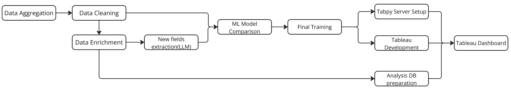

# NEISS Injury Analysis

In this project, we utilized the National Electronic Injury Surveillance System (NEISS) database to develop a model predicting injury severity. Our approach combines machine learning with natural language processing (NLP) techniques to extract insights from unstructured medical narratives.

## Table of Contents

- [Installation](#installation)
- [Data Sources](#data-sources)
- [Development Process](#development-process)
- [Tableau Workbook Demo](#tableau-workbook-demo)

## Installation

To get started with the project, clone the repository and install the necessary dependencies:

```sh
git clone https://github.com/dva023/neiss-injury-analysis.git
cd neiss-injury-analysis
python -m venv .venv  # create virtual env
source .venv/bin/activate  # activate the virtual env
pip install -r requirements.txt
```

For the AI-powered field extraction, copy `.env.example` to `.env` and add your API tokens.

## Data Sources

Primary data files required for this project:

- `consolidated_cleaned_neiss_2014_2023.csv`: Raw NEISS data (2014-2023)
  - Download from [SharePoint](https://gtvault.sharepoint.com/:x:/s/cse6242groupprojectchat/EbMcEGz4dzpKnl6qIT-oSG4BqToa0ZMSI4rVL9CFyb-gVg?e=cTygq0) (GaTech email login required)
- `neiss_code_text_mapping.csv`: Code-to-text mapping reference table
  - Located in `./data/`

## Development Process



Our analysis follows these key steps:

1. **Data Aggregation & Cleaning**
   - Clean raw NEISS data (`notebooks/data_cleaning.ipynb`)
   - Process and consolidate data from 2014-2023

2. **Data Enrichment**
   - Replace numeric codes with descriptions (`narrative_extraction/data_processor.py`)
   - Extract new fields using LLMs:
     - Define field extraction rules (`narrative_extraction/create_new_fields.py`)
     - Generate fields for each record (`narrative_extraction/generate_new_fields.py`)

3. **Model Development**
   - Perform descriptive analysis (`notebooks/descriptive_analysis.ipynb`)
   - Generate embeddings for narrative field (`notebooks/embedding_generation.ipynb`)
   - Compare model performance (`notebooks/model_comparison_on_10p.ipynb`)
     - Test three XGBoost configurations on different training data setups
   - Train final model (`notebooks/model_training_v1.ipynb`)

4. **Tableau Development**

   - Tabpy server setup (`notebooks/tabpy_v6_no_db.ipynb`)
   - Database for analysis setup
   - Tableau dashboard development (`./tableau/tableau_v6.twb`)

## Tableau Workbook Demo

In this demo, you will run a workbook locally with the connection to our TabPy server.

### Prerequisites

1. **TabPy Server Details**

   - Ensure you have access to the details: [SharePoint](https://gtvault.sharepoint.com/:t:/s/cse6242groupprojectchat/EVJUuC2n5QRLg9DnvhpDjX8BPPnen92JcfalH8GllpUUkw?e=VnCnmU) (GaTech email login required)
   - Alternatively, you can follow TabPy server setup instructions in `notebooks/tabpy_v6_no_db.ipynb` to boot up a local tabpy server.

2. **Software**

   - Tableau Desktop installed on your computer.

3. **Network Access**

   - Confirm that you can access the TabPy server over your network.  
   - Check any VPN, firewall, or proxy settings that might block the connection.

### **Demo Video**

For a step-by-step demonstration of the process, please watch our video: <https://youtu.be/WvGWpX0jjmU>

### Steps to Connect to TabPy

#### Step 1: Configure the Tableau Connection

1. Open Tableau Desktop.
2. Go to **Help > Settings and Performance > Manage External Service Connection**.
3. In the dialog box:
   - Select **TabPy** as the service.
   - Enter the **Server URL** (`tabpy.ericy.me`) in the *Hostname* field.
   - Set the **Port** (`9004`).
   - Check the **Sign in with username and password** box and provide the **Username** and **Password**.
   - Click **Test Connection** to ensure the connection is successful.

4. Click **OK** to save the settings.

#### Step 2: Open the Workbook

1. Double-click the workbook file (`./tableau/team023tableau.twbx`).
2. Select **Yes** for the warning box **Do you want to run these scripts?**.
3. Verify that the workbook connects to the TabPy server without errors.
4. Enter Presentation Mode by selecting icon in the toolbar, pressing the **F7** key, or select **Window > Presentation Mode**

### Troubleshooting

1. **Error: Authentication Failed**
   - Double-check the username and password.
   - Confirm with the server admin if your credentials have been updated or restricted.

2. **Connection Test Fails in Tableau**
   - Ensure that Tableau Desktop is configured with the correct host and port.
   - Restart Tableau and reattempt the connection test.

3. **Additional Help**
   - Please feel free to reach out to any members of Team 23 if help needed to resolve any issues.
